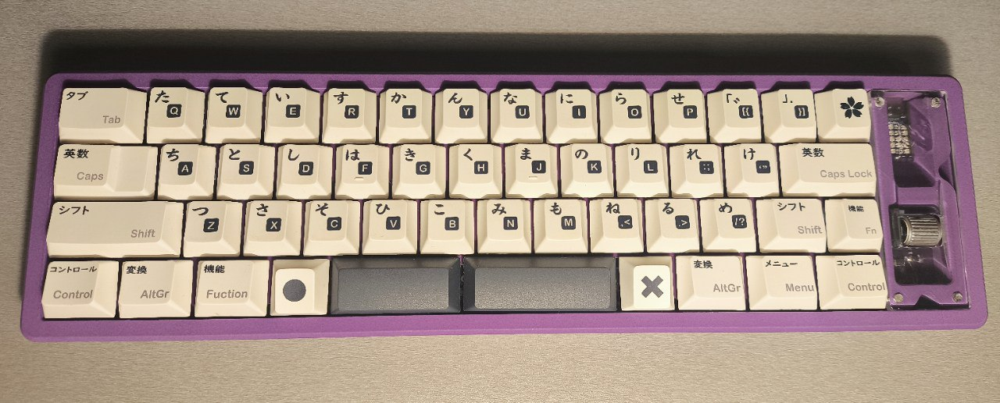

# soroka RGB - DIY-Friendly 40% keyboard

This is a fork of the [Soroka](https://github.com/kapee1/soroka/) project with added support for the RP2040-Zero-matrix. The only modifications are to the spacer (v2), which includes a cutout to improve the viewing angle, and the addition of two optional pads on the board (v2). However, you can also use the original files with minor adjustments—see the Build Guide for more details.

### Build guide [[EN]](https://github.com/kapee1/soroka/blob/main/build%20guides/Soroka%20v2%20Build%20guide%20%5BEN%5D.md) | [[RU]](https://github.com/kapee1/soroka/blob/main/build%20guides/Soroka%20v2%20Build%20guide%20%5BRU%5D.md)

__Parts for v1 and v2 are not compatible!__

### Main features:

* Easy to build. Great for soldering practice.
* Supports all cyrillic symbols in base layer.
* Compatible with most base-kit keycap sets. No 40s addons needed.
* Optional Panasonic EVQWGD001 or EC-11 encoder
* Plate also optional. You can build keyboard without a plate to reduce cost.
* Variable bottom-row with a 3u spacebars support.
* Customizable magnet panels
* RGB matrix display 5x5
* [ZMK Studio](https://github.com/aroum/zmk-soroka)

### RGB

### Layout:

### Sizes:

## BOM:
| Part     | Quantity |
|----------|----------|
| Soroka PCB                    | 1   | 
| Soroka Plate (Optional)       | 1   | 
| Soroka Case                   | 1   | 
| Soroka Panel  (clear)         | 1   | 
| Soroka Spacer (mod)           | 1   | 
| RP2040-Zero-matrix (unsoldered pins) | 1   | 
| 1N4148w SOD-123 Diodes        | 50  | 
| Panasonic EVQWGD001 (optional)| 1   |  
| Oval feets 22x4x1.5mm         | 4   |  
| Silicone washers 2x5x1        | 9   |
| M2 x 4mm Screws               | 13  |  
| M2 Inserts 3mm (OD3.2)        | 13  |  
| Round magnets 3x1 mm          | 8   | 

